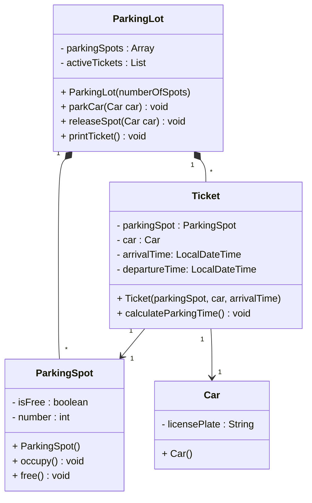

# Class diagram for Parking Lot

```mermaid
classDiagram
    class ParkingLot {
        - parkingSpots : Array
        - activeTickets : List
        + ParkingLot(numberOfSpots)
        + parkCar(Car car) void
        + releaseSpot(Car car) void
        + printTicket() void
    }

        
    class Ticket {
        - parkingSpot : ParkingSpot
        - car : Car
        - arrivalTime: LocalDateTime
        - departureTime: LocalDateTime
        + Ticket(parkingSpot, car, arrivalTime)
        + calculateParkingTime() void
    }

        
    class ParkingSpot {
        - isFree : boolean
        - number : int
        + ParkingSpot()
        + occupy() void
        + free() void
    }

        
    class Car {
        - licensePlate : String
        + Car()
    }
    
    Ticket "1" --> "1" Car
    Ticket "1" --> "1" ParkingSpot
    ParkingLot "1" *-- "*" ParkingSpot
    ParkingLot "1" *-- "*" Ticket
```